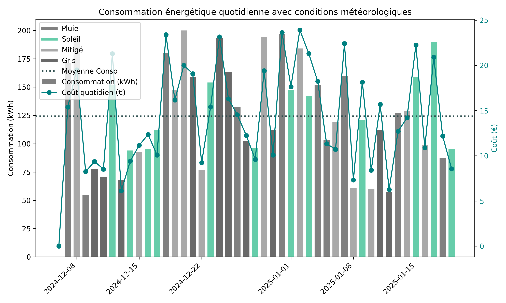

# 📊 Analyse Energie

**AnalyseEnergie** est une application Python qui permet d’analyser et visualiser la consommation énergétique quotidienne d’un foyer à partir de données de relevés. Le projet calcule la consommation, le coût, et prend en compte les conditions météorologiques pour enrichir l’analyse.

---

## 🧱 Structure du projet

```plaintext

Structure du projet :
├── .gitignore
├── .vscode
│   └── settings.json
├── README.md
├── data
│   ├── energy_data.csv
│   └── statistics.json
├── notebooks
│   └── analyse_energie.ipynb
├── src
│   ├── __init__.py
│   ├── generate_data.py
│   ├── main.py
│   ├── processing
│   │   ├── __init__.py
│   │   ├── data_processing.py
│   │   └── statistics_.py
│   └── visualization
│       ├── __init__.py
│       └── visualization.py
└── requirements.txt
└── tree_view.py
```

## 🔍 Fonctionnalités principales

- 📥 Chargement intelligent des données CSV
- 📈 Graphiques :
  - Statique (Matplotlib)
  - Interactif (Plotly, avec filtres météo)
- 🧮 Calculs statistiques :
  - Moyenne / max / min consommation
  - Coût total
- 🧠 Notebook d’analyse complémentaire
- ✅ Interface ligne de commande pour exécuter les étapes


## ▶️ Utilisation

```plaintext
# Exécuter le script principal avec un fichier de données
python main.py --file data/energy_data.csv --show-plot

# Graphique interactif
python main.py --interactive --show-plot

# Sauvegarder les statistiques en JSON
python main.py --save-stats
```

## 📊 Exemple de visualisation

Voici un exemple de graphique généré automatiquement par le projet :



## 🧪 Notebook

- Le fichier analyse_energie.ipynb permet une exploration interactive :
    - Statistiques descriptives
    - Appareils les plus énergivores
    - Visualisation rapide des données

## 📦 Installation
Créer un environnement virtuel et installer les dépendances :
```plaintext
python -m venv venv
source venv/bin/activate  # ou venv\Scripts\activate sous Windows
pip install -r requirements.txt
```

## 📊 Dashboard interactif avec Streamlit

Cette application propose un tableau de bord interactif pour visualiser les données de consommation énergétique.

### ▶️ Lancer l'application

Puis, exécutez la commande suivante depuis la racine du projet :
```plaintext
streamlit run app.py
```
- Par défaut, les données du fichier data/energy_data.csv sont chargées automatiquement.
- Vous pouvez également importer votre propre fichier CSV via l’interface.
---
🧰 Fonctionnalités
- 📈 Affichage de graphiques :

  - Statique (matplotlib)
  - Interactif (Plotly)

- 💰 Analyse des :
  - coûts
  - consommations
  - index d’énergie

- ☀️ Visualisation conditionnée par la météo (grand soleil, pluie, gris, etc.)
- 🔄 Upload d’un fichier personnalisé pour une analyse sur vos propres données